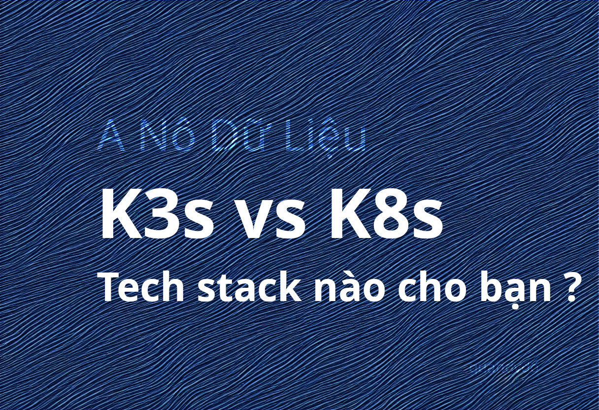

## SIDE QUEST: TECH STACK INTEL - Infrastructure

## What's K8s?
Kubernetes[~/Ku-be-ni-ti/] - K8s (tạm gọi là K8 vì có 8 chữ cái giữa "K" và "s") là một nền tảng mã nguồn mở cho phép tự động hóa việc triển khai, scale-up/scale-down ứng dụng container. Kubernetes vốn xuất phát từ dự án Google nhưng giờ đã trở thành chuẩn mực trong đám mây native.
### Một số tính năng chính của K3s:
- Automation Deploy : Tự động deploy container lên nhiều máy chủ.
- Horizontal Scaling :SCALE-UP/SCALE-DOWN dễ dàng dựa trên tải (workload của request).
- Service Discovery & Load Balancing : Gán IP và port cho container tự động và cân bằng tải giữa các node với nhau.
- Storage Orchestration : Hỗ trợ mount Google Cloud Storage, Amazon S3, storage local, Azure Blob Storage, v.v.
- Self-Healing : Tự Restart container khi fail, replace và reschedule khi node die, kill container không phản hồi health check và chỉ bắt đầu nhận request từ client khi đã sẵn sàng.
- Secret & Config Management : Lưu trữ và quản lý thông tin nhạy cảm như password, OAuth tokens, ssh keys.
K8s cực kỳ linh hoạt và hỗ trợ nhiều nhà cung cấp đám mây. Nó được sử dụng rộng rãi trong cả môi trường cloud public lẫn on-premises để quản lý ứng dụng container phức tạp một cách
> Source: https://kubernetes.io/
## What's K3s?
K3s là phiên bản nhỏ gọn của Kubernetes thiết kế cho các hệ thống có tài nguyên hạn chế như máy chủ vật lý hoặc máy ảo với cấu hình thấp. K3s giúp bạn triển khai và quản lý ứng dụng container mà không cần lo lắng quá nhiều về việc tối ưu hóa tài nguyên.
> Source: https://k3s.io/
## Chọn cái nào giữa K8s và K3s?
> Câu trả lời : **TUỲ**

Nếu cty bạn giàu, bạn có nguyên 1 đội ngũ IT hùng hậu, bác ái và sẵn sàng sống chết để có được 1 ticket treo vòng vòng trên jira 3d thì hãy chọn k8s 😊
Nếu cty bạn thích vượt khó, đòi hỏi bạn vượt qua chính mình hoặc tường lửa của công ty, hãy chọn k3s.
### Túm váy lại:
Khi lựa chọn giữa K3s và Kubernetes (k8s) cho môi trường on-premise, có một số điểm lợi ích mà K3s mang lại, đặc biệt là trong các trường hợp yêu cầu nhẹ hoặc cần tối ưu hóa về tài nguyên. Dưới đây là 3 lý do chính để xem xét K3s thay vì Kubernetes tiêu chuẩn:
- Tiết kiệm tài nguyên : K3s được thiết kế với mục tiêu giảm thiểu kích thước và độ phức tạp của triển khai Kubernetes. Nó loại bỏ nhiều thành phần không cần thiết, giúp nó trở nên nhẹ hơn đáng kể so với Kubernetes thông thường. Điều này đặc biệt hữu ích khi triển khai trên các hệ thống có nguồn lực hạn chế.
- Đơn giản hóa cài đặt : K3s tập trung vào việc đơn giản hóa quá trình cài đặt và cấu hình Kubernetes, điều này làm cho nó trở nên dễ dàng hơn nhiều để sử dụng trong môi trường on-premise, đặc biệt là đối với các tổ chức nhỏ hoặc những người mới bắt đầu với công nghệ Kubernetes.
- Tích hợp tốt với các hệ thống IoT và Edge : K3s thích hợp cho các giải pháp tại biên (Edge) và Internet of Things (IoT), nơi mà việc triển khai có thể cần phải chạy trên các thiết bị có nguồn lực hạn chế hơn so với máy chủ truyền thống.

Những lợi ích này làm cho K3s trở thành một lựa chọn hấp dẫn cho những ai đang tìm kiếm giải pháp Kubernetes nhẹ nhàng, hiệu quả về tài nguyên và dễ dàng triển khai.

#DataEngineering#DE #K8s #K3s #DễDàngChoNgườiMới 